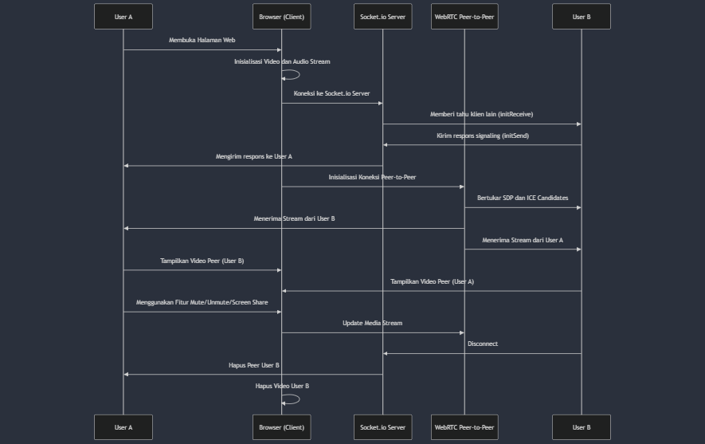

# WebRTC Vs Websocket

**WebRTC (Web Real-Time Communication)** adalah teknologi yang memungkinkan aplikasi web dan perangkat untuk berkomunikasi langsung satu sama lain dalam bentuk media streaming (video, audio) dan pertukaran data dalam real-time. Hal ini dilakukan melalui browser tanpa memerlukan plugin atau software tambahan.

## 1. Definisi WebRTC

WebRTC adalah API berbasis JavaScript yang memungkinkan browser atau aplikasi web untuk melakukan komunikasi real-time dengan audio, video, dan transfer data tanpa memerlukan perangkat lunak tambahan. WebRTC menyediakan kemampuan untuk membuat koneksi peer-to-peer (P2P), yang memungkinkan transmisi data atau media secara langsung antara dua browser atau aplikasi tanpa melewati server.

## 2. Latar Belakang

Sebelum adanya WebRTC, pengembang web yang ingin mengimplementasikan komunikasi real-time, seperti panggilan video atau audio di browser, harus menggunakan plugin atau teknologi eksternal seperti Adobe Flash atau Silverlight. Pengguna juga perlu mengunduh perangkat lunak tambahan untuk berinteraksi secara real-time, yang seringkali menyebabkan masalah kompatibilitas, keamanan, dan pengalaman pengguna yang buruk.

Dengan kemajuan teknologi web, WebRTC dikembangkan oleh Google dan mulai diadopsi sebagai standar oleh W3C dan IETF. WebRTC diciptakan untuk mengatasi masalah interoperabilitas ini dengan menyediakan API terbuka yang memungkinkan pengembang membangun komunikasi real-time secara lebih mudah, efisien, dan aman langsung di browser.

## 3. Manfaat Penggunaan WebRTC

- **Tanpa Plugin:** WebRTC beroperasi langsung di browser tanpa memerlukan plugin tambahan, sehingga mengurangi risiko keamanan dari perangkat lunak pihak ketiga.
- **Komunikasi Peer-to-Peer:** WebRTC memungkinkan komunikasi langsung antara dua perangkat (P2P), yang meminimalkan latensi dan mempercepat pengiriman data.
- **Keamanan:** Data yang dikirimkan melalui WebRTC dilindungi oleh enkripsi secara default, memastikan komunikasi yang aman.
- **Real-Time:** Dengan WebRTC, pengguna bisa mengirim dan menerima media (audio, video) serta data lain secara langsung dan dalam waktu nyata.
- **Cross-Platform:** WebRTC didukung oleh banyak browser modern, baik di desktop maupun perangkat mobile, yang membuatnya dapat digunakan secara luas di berbagai perangkat dan platform.
  
## 4. Perbandingan Sebelum dan Sesudah Adanya WebRTC

- **Sebelum WebRTC:**
  - Penggunaan plugin seperti Flash atau Silverlight yang rentan terhadap masalah keamanan.
  - Implementasi komunikasi real-time cenderung kompleks dan membutuhkan infrastruktur tambahan seperti server media.
  - Pengalaman pengguna lebih buruk karena memerlukan instalasi plugin atau software tambahan.
  - Latensi lebih tinggi karena komunikasi biasanya harus melalui server perantara, bukan langsung antara pengguna.
  
- **Sesudah WebRTC:**
  - Pengguna tidak perlu lagi mengunduh atau menginstal perangkat lunak tambahan untuk melakukan panggilan video atau berbagi data.
  - Pengembang dapat mengimplementasikan komunikasi real-time secara lebih mudah dengan API standar yang didukung oleh semua browser modern.
  - Kecepatan dan latensi komunikasi meningkat karena menggunakan koneksi peer-to-peer langsung.
  - Keamanan lebih baik dengan dukungan enkripsi end-to-end secara default.

## 5. WebSocket VS WebRTC

WebSocket dan WebRTC adalah dua teknologi yang berbeda, meskipun keduanya berfungsi untuk komunikasi real-time. Berikut penjelasan mengenai perbedaan dan hubungan antara **WebSocket** dan **WebRTC**:

### A. **WebSocket:**

- **Definisi:** WebSocket adalah protokol komunikasi berbasis TCP yang memungkinkan koneksi dua arah (full-duplex) antara klien dan server. Koneksi WebSocket tetap terbuka, memungkinkan pertukaran data terus menerus dan real-time antara browser (klien) dan server.
- **Fungsi:** WebSocket digunakan untuk mengirim dan menerima data dalam bentuk pesan secara efisien dan real-time antara klien dan server. WebSocket ideal untuk aplikasi yang membutuhkan pembaruan data secara terus-menerus, seperti aplikasi chat, notifikasi, atau permainan online.
- **Komunikasi:** WebSocket adalah komunikasi klien-server (client-server). Artinya, data dikirim dari klien ke server, kemudian server dapat merespons balik.

### B. **WebRTC:**

- **Definisi:** WebRTC adalah teknologi peer-to-peer (P2P) yang memungkinkan komunikasi real-time langsung antara dua perangkat (browser) tanpa perlu melewati server (setelah koneksi awal).
- **Fungsi:** WebRTC digunakan untuk berbagi media (audio, video) dan data secara langsung antara pengguna dalam koneksi P2P. Ini lebih sering digunakan untuk komunikasi video/audio dan berbagi data seperti file dalam aplikasi seperti video conferencing atau game.
- **Komunikasi:** WebRTC berfokus pada koneksi peer-to-peer (P2P). Setelah koneksi diinisiasi melalui server signaling, media dan data mengalir langsung antara perangkat pengguna tanpa memerlukan server perantara untuk transportasi data.

### C. **Perbedaan Utama:**

- **Koneksi:** WebSocket menggunakan model client-server, di mana klien berkomunikasi dengan server yang mengelola komunikasi dan pengiriman data. Sementara WebRTC menggunakan model P2P setelah inisiasi koneksi, di mana dua perangkat dapat berkomunikasi langsung satu sama lain.
- **Use Case:** WebSocket lebih cocok untuk aplikasi seperti chat atau notifikasi di mana pesan sederhana perlu dikirim bolak-balik secara real-time. WebRTC lebih cocok untuk aplikasi yang melibatkan media real-time seperti panggilan video atau streaming audio.
- **Data yang Dikomunikasikan:** WebSocket mengirimkan data dalam bentuk pesan teks atau biner. WebRTC terutama digunakan untuk mengirimkan media (audio, video), meskipun juga bisa digunakan untuk transfer data melalui kanal data WebRTC.

### D. **Hubungan antara WebSocket dan WebRTC:**

Meskipun berbeda, WebSocket dan WebRTC dapat digunakan bersama dalam beberapa skenario. Contoh penggunaannya adalah dalam **signaling**.

 **Signaling (Pengaturan Koneksi):** WebRTC memerlukan mekanisme signaling untuk memulai koneksi P2P. Signaling melibatkan pertukaran informasi seperti alamat IP dan port yang diperlukan untuk mengatur komunikasi P2P. **WebSocket** bisa digunakan untuk signaling ini, karena WebSocket memungkinkan pertukaran data real-time antara klien dan server.
  
  Setelah signaling selesai, WebRTC akan membuat koneksi P2P, dan komunikasi audio, video, atau data akan terjadi secara langsung antara perangkat pengguna tanpa perlu server perantara. WebSocket bisa tetap digunakan untuk komunikasi non-media, seperti sinkronisasi state atau pesan real-time sederhana.
  

Tekan disini untuk melihat gambar lebih jelas: [Video Conference](https://mermaid.live/view#pako:eNqNVNFq2zAU_RUhKDSQerOTOIkfCk660TIGpW43GHm5te8SYVvyJLlbV_rvk6zYcRsHlhdL5Bzde8650gtNRYY0ogp_1chTvGKwlVBuODG_CqRmKauAa_KgUMYEVLMg8TFgJcVv-5eBtMvzdcGQ69ExOBFpjtpi3cpjgiQon1AeY7_j49392mL3q1tEeaHFhf0ON7rqGl1tuIOcnRHfIzecKQYFU6AYiauC5WbhAI3Ai8vLffMR-YrlY50DuYYCSuC2ukPuEX3sm3O_sQwFyQwlrjMrTEtsLT1wnfCIfBEcc8PKccCLrvfAIwnbclOCb01nfLutOeSmRMdxULc1xzc2OBEoGdGwq0lu4yAFME7OGWf6DlNkTzg6GLDqN8YkK4lEVQmuiOqqN9QEeTYaKBlHTXdvqEZZOzSdnonXptnqP0714JWDvrP5NNHBDyasUGqTpCTJ1W2Ty836E1kDz1gGGlWvralnjnPtW2-b4IygjMHAyU4rWmwLzcB43Q7eUCunCfGJMbyHsmKFjdrNlZVJzl2Nd8n9Dyce9eTOPPKZ6VpawiPsgJ-8CoeBc4SvtcYPD7y0nySVaOYq2YHEU8k9VNZqZ2V3Ibo-Qo9cMZUKzjHVTUI2BSxEATYG7N_R_ogeSMOjeA1VrZz6figDF9ghnVstlI5pibIElpkH8sVSN1TvsMQNjczSRJdv6Ia_GhzUWiTPPKWRljWOqRT1dkejn1Aos6sb8funtYWYx-qHEP0tjV7oHxoFfugtZ37ohx_ni5m_mE7H9JlGs6kX-P5yHgTL5XwyXyxex_Rvc4DvTWbBNAznwWK2nCzmk_D1H3pw6fo)

WebSocket dibutuhkan dalam video conference untuk menangani **proses signaling**, yaitu pertukaran informasi yang diperlukan agar dua pengguna (atau lebih) bisa saling terhubung secara **peer-to-peer** menggunakan WebRTC. Berikut penjelasan lebih rinci mengapa WebSocket penting dalam konteks video conference:

### 1. **Proses Signaling**

- **Signaling** adalah langkah pertama sebelum koneksi peer-to-peer antara dua pengguna bisa dibentuk. Signaling bertugas untuk:
  - Mengidentifikasi pengguna yang ingin terhubung.
  - Bertukar informasi teknis seperti alamat IP, protokol koneksi, dan codec yang digunakan untuk video/audio.
  - Bertukar **SDP** (Session Description Protocol), yang berisi rincian tentang bagaimana koneksi peer-to-peer dapat dilakukan.
  - Bertukar **ICE candidates** (Interactive Connectivity Establishment), yang membantu kedua klien menemukan jalur terbaik untuk berkomunikasi secara langsung (peer-to-peer).

   WebRTC tidak memiliki mekanisme built-in untuk signaling. Oleh karena itu, **WebSocket** digunakan sebagai cara untuk mengirim dan menerima informasi signaling antara klien melalui server.

### 2. **Koneksi Real-Time dan Full-Duplex**

- WebSocket memungkinkan komunikasi **real-time** yang **full-duplex** (dua arah sekaligus) antara klien dan server. Ini sangat cocok untuk aplikasi seperti video conference, di mana informasi signaling harus dikirim bolak-balik dengan cepat untuk menjaga sesi tetap berjalan.
- WebSocket sangat efisien karena setelah koneksi WebSocket dibuka, klien dapat mengirim dan menerima pesan tanpa membuat ulang koneksi, sehingga sangat cepat dan responsif.

### 3. **Mengelola Koneksi Peer-to-Peer**

- Saat koneksi peer-to-peer sudah terbentuk melalui WebRTC, WebSocket masih bisa digunakan untuk hal-hal lain seperti:
  - **Mengelola sesi** (misalnya menambahkan atau menghapus pengguna dari panggilan).
  - **Pesan kontrol** seperti mute/unmute, menutup video, atau perubahan pengaturan audio/video.
  - **Notifikasi** atau update real-time yang diperlukan selama panggilan.

### 4. **Menyediakan Server Signaling**

- WebSocket berfungsi sebagai **server signaling** yang menghubungkan berbagai klien untuk bertukar informasi koneksi. Tanpa server signaling, klien tidak akan tahu bagaimana cara terhubung secara peer-to-peer.
- Server signaling ini tidak perlu menangani lalu lintas media (audio dan video), yang dilakukan langsung oleh WebRTC secara peer-to-peer. Namun, WebSocket diperlukan untuk "memperkenalkan" dua pengguna yang akan saling terhubung.

### Mengapa WebSocket Dibutuhkan

- **Real-time communication**: WebSocket memungkinkan komunikasi dua arah dengan latensi rendah, sangat penting untuk negosiasi signaling sebelum koneksi WebRTC dapat dibuat.
- **Pengiriman data signaling**: WebRTC membutuhkan mekanisme eksternal untuk bertukar informasi teknis (seperti SDP dan ICE candidates), dan WebSocket adalah cara yang efisien untuk melakukan ini.
- **Kontrol dan manajemen sesi**: WebSocket memungkinkan pesan kontrol dikirim selama sesi video conference berlangsung, misalnya untuk mengelola siapa yang sedang berbicara atau untuk mengirim instruksi khusus.

### Tanpa WebSocket

Tanpa WebSocket atau mekanisme signaling lain, klien tidak bisa bertukar informasi koneksi (signaling) yang diperlukan untuk membangun koneksi peer-to-peer. WebRTC hanya bisa bekerja setelah signaling selesai, dan WebSocket adalah metode paling umum yang digunakan untuk tujuan ini.

Jadi, **WebSocket** adalah komponen kunci yang memungkinkan WebRTC berjalan dengan baik pada video conference, karena berfungsi sebagai pengirim informasi signaling secara real-time antara pengguna.

### E. **Analogi Penggunaan WebSocket dan WebRTC:**

### Analogi Video Conference

Bayangkan kamu ingin melakukan percakapan pribadi dengan temanmu di sebuah ruangan terpisah. Tetapi sebelum kalian bisa masuk ke dalam ruangan tersebut, ada beberapa hal yang perlu dilakukan terlebih dahulu.

1. **Signaling dengan WebSocket: Mengatur Pertemuan**
   - Bayangkan **WebSocket** adalah seperti seorang *penyelenggara pertemuan* atau *koordinator* yang mengatur agar kamu dan temanmu bisa bertemu di ruang pribadi.
   - Kamu memberi tahu koordinator (WebSocket) bahwa kamu ingin berbicara dengan temanmu. Kamu juga memberi tahu koordinator rincian teknis seperti **tempat kamu berada** (alamat IP), **apa yang akan kamu bawa** (informasi perangkat seperti kamera, mikrofon), dan **rencana pertemuan** (cara terbaik untuk terhubung).
   - Koordinator kemudian menyampaikan informasi ini ke temanmu (melalui server WebSocket), dan temanmu memberikan respons kembali, misalnya lokasi tempat ia berada dan rincian perangkat yang dia bawa.
   - Koordinator memastikan bahwa kalian berdua sudah mendapatkan informasi yang diperlukan untuk bertemu secara langsung.

2. **WebRTC: Pertemuan di Ruang Pribadi**
   - Setelah semua informasi penting sudah diatur oleh si koordinator (WebSocket), kamu dan temanmu tidak lagi memerlukan koordinator untuk bicara. Kalian berdua sekarang bisa masuk ke **ruang pribadi** (koneksi peer-to-peer via WebRTC).
   - Di dalam ruangan ini, kalian bisa berbicara **secara langsung** (mengirim video, audio, dan data) tanpa gangguan dari orang lain. Ini adalah bagian **WebRTC** yang memungkinkan kalian berbicara secara langsung tanpa bantuan pihak ketiga.

3. **WebSocket (Opsional): Pengelola Sesi**
   - Meskipun pertemuan sudah berlangsung, koordinator (WebSocket) bisa tetap berada di luar ruangan untuk **membantu jika ada masalah** atau jika kamu ingin mengirim pesan tertentu, seperti "Saya akan bicara lebih pelan" (mute/unmute), atau kamu ingin mengakhiri pertemuan.
   - Koordinator tidak ikut campur dalam percakapan, tetapi tetap bisa mengirim pesan-pesan kontrol jika diperlukan.

### Kesimpulan dari Analogi

- **WebSocket** berperan seperti seorang **koordinator** yang membantu kamu dan temanmu saling mengenal dan membuat rencana untuk bertemu. Tanpa si koordinator, kamu tidak akan tahu bagaimana cara menemukan temanmu atau bagaimana memulai percakapan.
- **WebRTC** adalah **ruang pribadi** di mana kamu bisa berbicara secara langsung dengan temanmu, tanpa memerlukan koordinator setelah pertemuan dimulai. Koneksi ini lebih cepat dan aman, karena kalian berdua sudah tahu cara berkomunikasi tanpa bantuan perantara lagi.

Jadi, **WebSocket** mengatur pertemuan (signaling), dan **WebRTC** adalah tempat pertemuan itu terjadi (komunikasi media peer-to-peer).

### F. **Kapan Menggunakan WebSocket vs. WebRTC:**

- **Gunakan WebSocket** jika Anda hanya membutuhkan komunikasi dua arah yang real-time antara klien dan server, seperti chat atau sistem notifikasi.
- **Gunakan WebRTC** jika Anda membutuhkan komunikasi langsung (P2P) antara pengguna, terutama untuk media seperti panggilan video, streaming audio, atau berbagi file besar tanpa perantara server.

### Kesimpulan

WebSocket dan WebRTC memiliki tujuan yang berbeda tetapi bisa saling melengkapi dalam membangun aplikasi yang memerlukan komunikasi real-time. Jika Anda membutuhkan komunikasi real-time antara server dan klien (client-server), WebSocket adalah pilihan yang tepat. Namun, jika Anda memerlukan koneksi langsung antar pengguna (P2P) dengan audio/video atau berbagi data dalam real-time, WebRTC adalah solusi yang lebih cocok.

## Repository Github Untuk Project Berbasis WebRTC

**Web RTC Experiments Oleh Muaz Khan**

<https://github.com/muaz-khan/WebRTC-Experiment/tree/master?tab=readme-ov-file>

**WebRTC Video Conference Simple Peer Oleh Dirvann**

<https://github.com/Dirvann/webrtc-video-conference-simple-peer>
